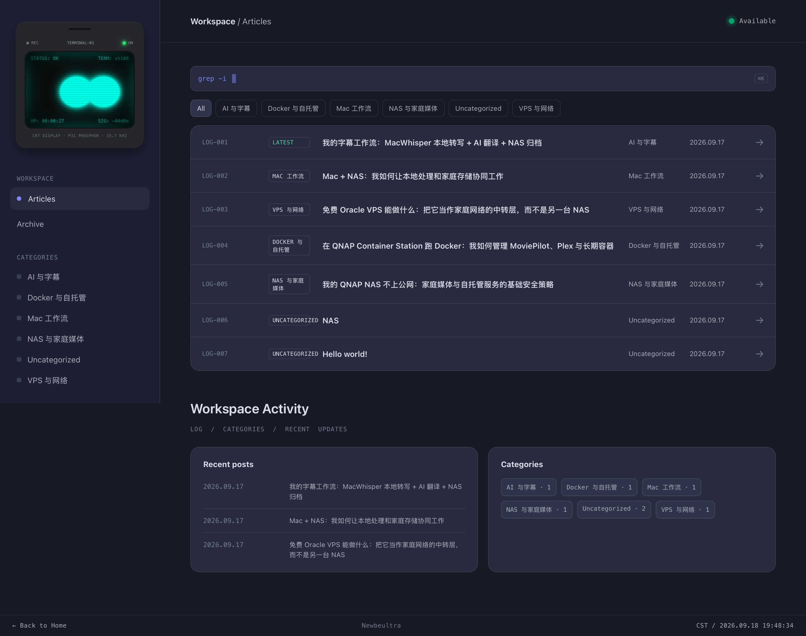

# CRT Terminal

<p align="center"><b>一个复古终端风格的 WordPress 主题，内置会看你鼠标、会眨眸微笑的 CRT 显示器伴侣</b></p>
<p align="center"><b>A retro-terminal WordPress theme featuring an interactive CRT companion that tracks your cursor, blinks, and smiles</b></p>

<p align="center">
  
  
  
  
</p>

<p align="center">
  
</p>

> **说明 / Note**：本项目（包括代码、文档与本 README）完全由 AI 生成。<br>
> **This project (code, documentation, and this README) was entirely generated by AI.**

---

## 简体中文

### 项目简介

CRT Terminal 是一款极简、无图片依赖的 WordPress 博客主题，视觉语言取材于终端 / 命令行界面：等宽字体、暗色配色方案、扫描线纹理。主题最独特的部分是嵌入在网站 Logo 位置的**交互式 CRT 显示器**——它有一对会随光标移动的眼睛，会随机眨眸、微笑（⌒⌒弧线）、惊讶、好奇，累计五分钟无操作后还会"睡着"。所有视觉细节（配色、扫描线、辉光、眼睛形状与大小、顶部状态灯）都可以在 WordPress 后台的**外观 → 自定义**里调整，不需要写代码。

### 核心特性

- **终端风格全站界面**：侧边栏文章列表、等宽字体、暗色配色，共 8 套预设配色方案（Termius / Nord / Dracula / Monokai / 黑客蓝 / 黑客绿 / Flexoki / 浅色工作台）
- **交互式 CRT 显示器伴侣**
  - 眼睛跟随鼠标 / 触摸移动，带弹簧惯性动画
  - 随机眨眸、开心、惊讶、好奇、**微笑（⌒⌒弧线）**五种表情，点击机身可主动触发
  - 五分钟无操作自动"睡眠"，任意交互唤醒
  - 屏幕四周内发光、可切换"横向扫描线／像素颗粒"两种复古纹理效果，强度、密度、透明度均可调
  - 眼睛宽度、高度、圆角三项独立滑块，可自由组合出圆形、正方形、长方形、圆角矩形
  - 显示器外壳颜色、屏幕显示色、机身 LED 颜色均可自定义
- **顶部状态指示灯**：颜色、亮度、呼吸闪烁频率可调；就绪状态文字带终端故障风格的字符随机跳变动画
- **终端风格登录页与 404 页**：与前台视觉统一
- **无图片依赖**：整站不依赖任何外部图片资源，纯 CSS/HTML 渐变与图形绘制
- **响应式与无障碍**：CRT 组件全部使用容器查询单位（cqw/cqh）自适应任意屏幕尺寸；尊重系统"减少动态效果"辅助设置

### 安装方法

1. 在 GitHub 仓库页面点击 **Code → Download ZIP** 下载主题包
2. 登录 WordPress 后台，进入 **外观 → 主题 → 添加新主题 → 上传主题**
3. 选择下载的 ZIP 文件并点击**现在安装**
4. 安装完成后点击**启用**

### 使用方法

启用主题后，进入 **外观 → 自定义**，会看到两个新分区：

**主题外观**
- 默认配色方案 / 面板圆角 / 界面密度

**CRT 显示器伴侣**
- 屏幕显示颜色、显示器外壳颜色、LED 指示灯颜色
- 效果模式（横向扫描线 / 像素颗粒）及各自的密度、粗细、透明度滑块
- 整体色泽强度、屏幕边缘内发光强度
- 眼睛宽度、眼睛高度、眼睛圆角

**顶部状态 LED**
- LED 颜色、亮度、闪烁频率

所有选项支持 Customizer 实时预览，调整后点击**发布**即可生效。

### 目录结构

```
crt-terminal/
├── style.css              # 主样式表，含主题头信息
├── functions.php          # 主题功能与 Customizer 设置注册
├── header.php             # 页头模板（含 CRT 组件 HTML 结构）
├── footer.php             # 页脚模板
├── front-page.php         # 首页模板
├── single.php             # 文章页模板
├── index.php              # 默认后备模板
├── 404.php                # 404 错误页
├── assets/
│   ├── css/login.css      # 登录页样式
│   └── js/
│       ├── app.js         # 前台交互脚本
│       └── crt-companion.js  # CRT 显示器眼睛/表情/跳变动效脚本
└── screenshot.png         # 主题预览图
```

### 环境要求

- WordPress 6.0 及以上
- PHP 7.4 及以上
- 现代浏览器（CRT 组件依赖 CSS 容器查询，建议 Chrome 105+ / Safari 16+ / Firefox 110+；旧浏览器会优雅降级为静态显示）

### 许可证

本项目基于 [GPLv2 或更高版本](LICENSE) 开源，与 WordPress 核心保持一致的授权协议。你可以自由使用、修改、分发本主题，但衍生作品必须以相同许可证开源。

### 贡献

欢迎通过 Issue 反馈问题或通过 Pull Request 提交改进。

---

## English

### Overview

CRT Terminal is a minimal, image-free WordPress blog theme inspired by terminal / command-line interfaces: monospace typography, dark color schemes, and scanline textures. Its signature feature is an **interactive CRT monitor companion** embedded in the site logo — a pair of eyes that track your cursor, blink randomly, smile (a ⌒⌒ arc expression), look surprised or curious, and fall "asleep" after five minutes of inactivity. Every visual detail (color palette, scanlines, glow, eye shape and size, status LED) is configurable from the WordPress **Appearance → Customize** panel — no code required.

### Key Features

- **Terminal-style layout site-wide**: sidebar post list, monospace fonts, dark palettes with 8 built-in presets (Termius / Nord / Dracula / Monokai / Hacker Blue / Hacker Green / Flexoki / Light Workspace)
- **Interactive CRT companion**
  - Eyes follow the cursor / touch with spring-physics inertia
  - Five expressions — blink, happy, surprised, curious, and **smiling (⌒⌒ arc)** — randomly triggered or fired on click
  - Auto-sleeps after 5 minutes of inactivity, wakes on any interaction
  - Inward screen edge glow; switchable "scanline" or "pixel grain" retro texture, each with adjustable density, thickness, and opacity
  - Independent width / height / corner-radius sliders for the eyes — freely combine into circles, squares, rectangles, or rounded rectangles
  - Customizable monitor case color, screen display color, and body LED color
- **Top status LED**: adjustable color, brightness, and breathing/blink speed; the "ready" status text has a terminal-glitch character-scramble animation
- **Terminal-styled login and 404 pages** matching the front-end aesthetic
- **Zero external images**: the entire theme is built with pure CSS/HTML gradients and shapes
- **Responsive & accessible**: the CRT widget uses CSS container query units (cqw/cqh) to scale to any screen size, and respects the `prefers-reduced-motion` setting

### Installation

1. On the GitHub repo page, click **Code → Download ZIP**
2. In your WordPress dashboard, go to **Appearance → Themes → Add New → Upload Theme**
3. Select the downloaded ZIP and click **Install Now**
4. Click **Activate**

### Usage

After activation, go to **Appearance → Customize**. Two new sections will appear:

**Theme Appearance**
- Default color palette / panel radius / UI density

**CRT Companion**
- Screen display color, monitor case color, LED indicator color
- Effect mode (scanline / pixel grain) with independent density, thickness, and opacity sliders
- Overall glow intensity, screen edge inner-glow intensity
- Eye width, eye height, eye corner radius

**Top Status LED**
- LED color, brightness, blink speed

All settings support live preview in the Customizer — click **Publish** to apply.

### Directory Structure

```
crt-terminal/
├── style.css              # Main stylesheet with theme header
├── functions.php          # Theme functions & Customizer settings
├── header.php             # Header template (includes CRT widget markup)
├── footer.php             # Footer template
├── front-page.php         # Homepage template
├── single.php             # Single post template
├── index.php              # Default fallback template
├── 404.php                # 404 error page
├── assets/
│   ├── css/login.css      # Login page styles
│   └── js/
│       ├── app.js         # Front-end interaction script
│       └── crt-companion.js  # CRT eyes / expressions / scramble animation script
└── screenshot.png         # Theme preview screenshot
```

### Requirements

- WordPress 6.0+
- PHP 7.4+
- A modern browser (the CRT widget relies on CSS Container Queries — Chrome 105+ / Safari 16+ / Firefox 110+ recommended; older browsers degrade gracefully to a static display)

### License

This project is licensed under [GPLv2 or later](LICENSE), matching WordPress core's licensing terms. You are free to use, modify, and distribute this theme; derivative works must remain open source under the same license.

### Contributing

Issues and pull requests are welcome.
